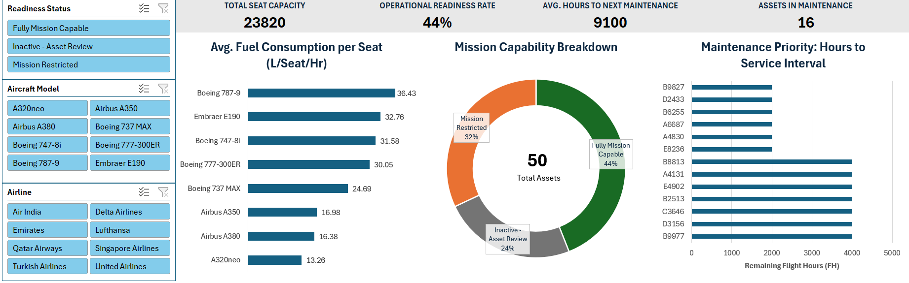

# Aviation-Fleet-Sustainment-Dashboard
Interactive Excel Dashboard for tracking aircraft readiness and maintenance cycles for a 50-asset aviation fleet

# Project Overview
This project is a dynamic **Fleet Management & Sustainement Tool** designed to provide key insights into aircraft availability and operational efficiency.The dashboard allows to identify maintenance bottlenecks and fuel efficieny gaps across a 50-asset global fleet.

# Quick Links

[Download the Interactive Dashboard (.xlsx)](https://github.com/Gloria7879/Aviation-Fleet-Sustainment-Dashboard/blob/main/Aviation_Fleet_Sustainment_Dashboard.xlsx)
  
[Raw Dataset](https://github.com/Gloria7879/Aviation-Fleet-Sustainment-Dashboard/blob/main/skyfleet_aircraft_dataset.csv)

# Data Source

[Original Dataset on Kaggle](https://www.kaggle.com/datasets/hemangkumar/commercial-aircraft-inventory-and-specs)

# Tools Used
**Excel:** Data Cleaning, Visualization and Dashboarding

# The Process

## 1.Initial Data Inspection & Preparation (Excel)
- **Visual Audit:** Performed a scan in **Excel** to identify column relationships, data types and obvious data errors.
  
## 2. Advanced Feature Engineering
- **Maintenance Thresholds:** Utilized **XLOOKUP** to assign service interval hours to assets based on Engine Type. Calculated Service Interval Remaining to predict downtime.
- **Operational Logic:** Developed a dynamic Readiness Status engine with **conditional formatting** for instant visual alerts.
- **Economic Metrics:** Derived Fuel Per Seat to analyze fleet efficiency.
- **Binary Flags:** Implemented a Maintenance Flag to maintain data integrity during multi-use of slicers.

## 3. Interactive Visualization
- **KPI development:** Calculated key metrics including **Total Seat Capacity,Operational Readiness Rate, Average Hours to Next Maintenance, and Assets in Maintenance.**
- Developed a **Maintenance Priority** graph to identify assets approching critical maintenance thresholds.
- Developed a **Mission Capabiity Breakdown** to track the Operational Readiness Rate (ORR).
- Integrated **Slicers** to allow for multi-dimensional filtering (Airline/Model/Status).

  # Key Insights & Findings
  -**Operational Readiness Gap:** The fleet currenly maintains a **44% baseline ORR**. While this includes retired assets, the dashboard reveals that the 16 assets currently under maintenance are the primary bottleneck for active operations.
  -**Fuel Efficiency Insight:** There is a siginificant performance gap between different aircraft models.The **Airbus A320neo (13.26 L/Seat/Hr)** is nearly **3x more efficient** than the **Boeing 787-9 (36.43 L/Seat/Hr)** within this specific fleet configuration.
  -**Service Life Remaining (SLR) Analysis:** The fleet is currently operating with an **average of 9,100 flight hours** before the next major service interval.The **Fully Mission Capable (FMC)** fleet has a high sustainability buffer, **averaging 10,363 remaining hours**. This indicates that the active fleet is currently in its prime operating window, with significant time before a major maintenance surge will impact availability.
-**Maintenance Priority:** The dashboard successfully identified and ranked the top 10 assets nearing their next scheduled next maintenance. I isolated 3 assets with only 4,000 flight hours remaining. By identifying the top 10 priority assets, this allows proactive scheduling for service, minimizing the risk of unplanned **AOG(Aircraft on Ground) events.
